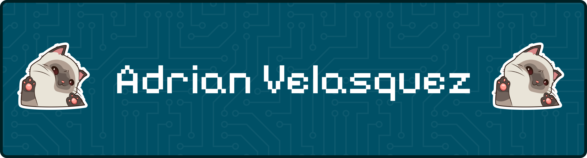

<!-- hello 🫡 -->
<!-- banner -->

---

### 🚀 About Me

- 🎓 4th-year B.Eng. in Systems and Computer Engineering student at Universidad de los Andes (GPA 4.4/5.0)
- 💼 Data Analyst / Software Developer at the Faculty of Administration — Universidad de los Andes
- 🔐 Currently preparing for the CC (Certified in Cybersecurity, ISC2) certification
- 🧠 Interested in Cybersecurity and Artificial Intelligence
- 🌱 Working on my thesis project: a lightweight cryptographic library for IoT devices, featuring a Quantum Permutation Pad Random Number Generator (QPP-RNG)

<!-- gif -->

  

---

### 🛠️ Featured Projects

**🔒 IoT Cryptographic Library** *(Thesis Project)*
`Rust` `C`
Lightweight cryptographic library for resource-constrained IoT devices, including an optimized QPP-RNG (Quantum Permutation Pad Random Number Generator) implementation.

**🛜 Agentic Network Monitoring System** *(Work in progress)*

---

### Tech Stack

**Languages**

  
  
  
  
  
  
  
  

**Frameworks**

  
  
  
  
  
  

**Cloud & Tools**

  
  
  
  
  

<!-- 

  

 -->
